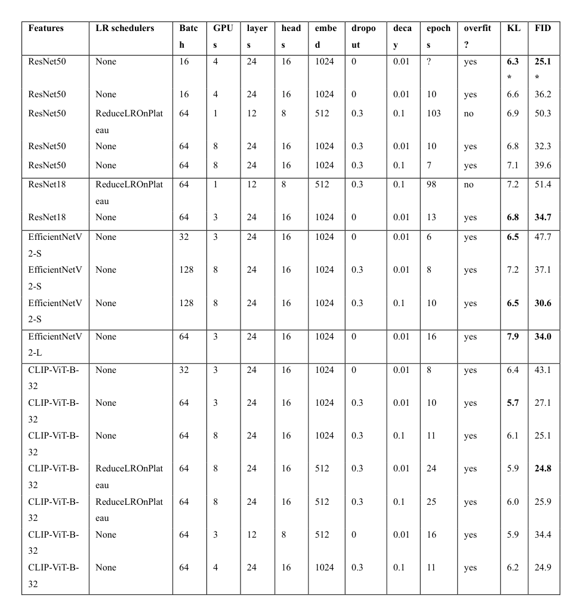
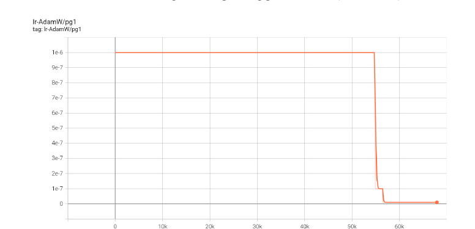
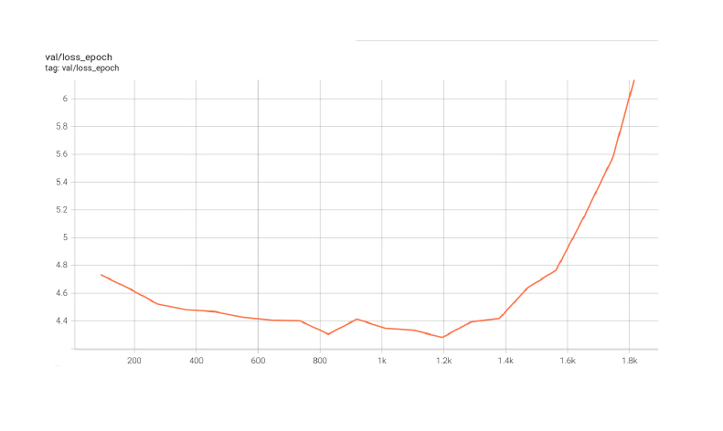
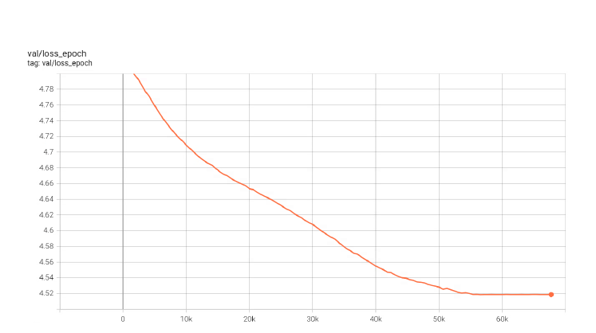

# Exploration of Multimodal Approaches in Image-to-Audio Synthesis
This organization was created for coursework conducted at the *National University of Kyiv-Mohyla Academy*. It contains the modified repository for video feature extraction and the repository for the experiments with the finetuning of the [SpecVQGAN](https://github.com/v-iashin/SpecVQGAN) model. This `README` file provides a summary of our experiments, fine-tuning efforts, and key insights from the coursework.

## Table of Contents
1. [Goals of Experiments](#goals-of-experiments)
2. [Feature Extraction](#feature-extraction)
3. [Experiments](#experiments)
   - [Architecture Comparison and Model Selection](#architecture-comparison-and-model-selection)
   - [Dataset and Resources](#dataset-and-resources)
   - [Evaluation](#evaluation)
4. [Results](#results)
   - [Impact of Feature Extractors](#impact-of-feature-extractors)
   - [Impact of Model Configurations](#impact-of-model-configurations)
   - [Impact of Regularization](#impact-of-regularization)
   - [Impact of Overfitting](#impact-of-overfitting)
5. [Limitations of the Experiments](#limitations-of-the-experiments)
6. [Conclusions](#conclusions)

## Goals of Experiments
The goal of our work was to examine several well-documented observations about deep learning algorithms and test them in the image-to-audio domain, through a comparative analysis of different parameter configurations.

We aimed to:

* Compare the generalizability and complexity of different feature extractor models, such as ResNet, EfficientNetV2, and CLIP.
* Test whether simplified models could achieve a better result with limited data than larger models, and explore the importance of generalization.
* Evaluate the impact of core transformer parameters, including the number of layers, attention heads, and embedding dimensions.
* Investigate how regularization techniques (e.g. dropout, weight decay, learning rate schedulers) influence model generalizability and performance.

Additionally, we conducted a comparative analysis of current state-of-the-art approaches, focusing on architectural differences. We examined the impact of direct tokenization versus spectrogram-based representations, and the use of transformer models for samping audio tokens.

## Feature extraction
We experimented with replacing the **ResNet50** RGB feature extractor used in SpecVQGAN with alternative models. Specifically, we decided to pick **EfficientNetV2** (**S** and **L** variants) and **CLIP-ViT-B-32**. We also experimented with different variants of ResNet, specifically with **Resnet18**. All of the models had been pre-trained on the ImageNet dataset.

For extracting ResNet features, we used branch `specvqgan` of the `video_features` repository that authors of SpecVQGAN also used. We switched to the `main` branch of this repository for extracting CLIP features.

For EfficientNetV2 features, we forked the `specvqgan` branch of `video_features` repository and added a torchvision implementation of EfficientNetV2 architecture. This repository can be found in this organization: [link](https://github.com/Exploration-of-image-to-audio-synthesis/video-features-extraction). 

## Experiments
### Architecture comparison and model selection
We compared two models for audio generation from video frames: [SpecVQGAN](https://v-iashin.github.io/SpecVQGAN) and [IM2WAV](https://arxiv.org/abs/2211.03089) to choose a suitable model for our experiments. Although IM2WAV benchmarks suggest their model outperforms SpecVQGAN, when testing these models in real scenarios we observed that SpecVQGAN produces cleaner and less noisy audio. We suppose that this improvement is due to using spectrogram tokens instead of pure audio tokens. However, IM2WAV was better at recognizing objects and details in the frames, and reflecting them in the generated sound, possibly due to better performance of the CLIP feature extractor.

Ultimately, we chose to focus on SpecVQGAN due to its performance, as well as clarity of code and a detailed documentation. We also assumed it had more space for improvement, since it relies on an older ResNet50 feature extractor, compared to the more recent CLIP model used by IM2WAV.

> [!NOTE]
> We attempted to replicate SpecVQGAN's results on the VAS dataset, but initial attempts did not align with those claimed by the authors. [Similar issues](https://github.com/v-iashin/SpecVQGAN/issues/35) have been raised on the SpecVQGAN Github repository. Nevertheless, since our primary goal was comparative analysis, reproducing the exact results was not critical, as we could still base our comparisons on the results we achieved.

### Dataset and Resources
We used the Visually Aligned Sounds (VAS) dataset for all of our experiments due to its small size, which allowed for quicker training and testing. Training was initially done on a personal RTX 3060 (6 GB VRAM) GPU but later scaled to a desktop with an RTX 3080 (12 GB VRAM) and finally a SLURM cluster using A100 and V100 GPUs with 40 and 80 GB VRAM.

### Evaluation
We used the same metrics used by the authors of SpecVQGAN to evaluate the fidelity and relevance: **Fréchet Inception Distance (FID)** and Melception-based **KL-divergence (MKL)** (lower is better).

## Results
The table below presents the comparison between different combinations of feature extractors and hyperparameters used when training the model and the results obtained. The models are group by the feature extractor used. The best results for each feature extractor are bolded.

The values from the frist row *(marked with *)* represent the results listed on the SpecVQGAN Github repository. We were not able to reproduce them.

From these results we are able to make a couple of observations about the impact of different parts of the pipeline on performance.

### Impact of feature extractors
After some tuning, EfficientNetV2 and CLIP models were able to outperform ResNet50 on the same hyperparameters. This confirmed that the performance of the model improves when using a feature extractor that performs better on benchmarks. The CLIP model works exceptionally well and aligns with the hypothesis of authors of [IM2WAV](https://arxiv.org/abs/2211.03089) that multimodal optimization of CLIP allows for an easier sampling of an additional modality (in this case, audio features).

We have confirmed our initial hypothesis that more complex models like ResNet50 (compared to simpler ResNet18) can improve MKL scores due to their ability to better capture unorthodox patterns and align predictions with the target. However, they are prone to overfitting and poorer generalize to unseen data, producing higher FID due to their specificity. In the results, the model trained on ResNet18 features has MKL values of **6.8** compared to **6.6** of the equivalent model which uses ResNet50 features, while having lower FID score of **34.7** *(ResNet18 features)* against **36.2** *(ResNet50 features)*

> [!NOTE]
> Interestingly, this hypothesis did not apply for EfficientNetV2 models: the model trained with EfficientNetV2-L features showed improvement FID metrics but lower MKL scores. We attributed this to EfficientNetV2’s compound scaling method and complex architecture, unlike the depth-based scaling in the simpler ResNet50. This complexity makes the model's behavior harder to predict, because there is no direct scaling of specificity in its features.  Another reason for this is the fact that the larger model is able to capture a broader range of features that ultimately represent the ground truth better, even if the distribution of predicted features is not identical.

### Impact of model configurations
Our experiments confirmed our beliefs that simpler models can perform better with limited data. As an example, consider the first model in the list that uses CLIP extractor with the second to last model. Both of these models have the same hyperparameters, but different model structure (different number of layers, attention heads, and embedding dimensions). The simplified model has significantly outperformed the more complex version. However, when combining model simplifications with regularization techniques, the model starts to underfit and results in worse performance.

### Impact of regularization
We tested four regularization techniques: dropout, L2 regularization using bigger weight decay, taking smaller learning rate (by increasing batch size) and using learning rate schedulers (We chose the [ReduceLROnPlateau](https://pytorch.org/docs/stable/generated/torch.optim.lr_scheduler.ReduceLROnPlateau.html#torch.optim.lr_scheduler.ReduceLROnPlateau) scheduler with patience 10)

Key observations from these tests confirm the importance of regularization:
* Dropout at **0.3** consistently improved model performance, regardless of feature extractor or other parameters.
* Increasing weight decay from **0.01** to **0.1** also helped prevent overfitting and most of the time improved the performance, with some exceptions.
* Increasing batch size had minimal impact on accuracy, enabling scaling based on available amount of GPU VRAM.
* Learning rate schedulers smoothed training curves toward the end, and allowed the model to train for more epochs before overfitting. An example of how a learning rate graph looks like when applying the `ReduceLROnPlateau` scheduler:
  

  
  

  The learning rate drops in value when the model stops improving the loss, which slows down the training and prevents overfit.

### Impact of overfitting
During training, we noticed that the model starts to overfit after some time. See the graph below:

Even though the overfitted version of the model is not saved, we explored ways to prevent overfitting and let the model train longer. We suppressed overfitting by combining learning rate schedulers and simplifying the model structure, and as a result our training graph now looked like this:

The loss initially decreases silimarly as before, indicating it wasn't underfitting. However, as shown, in both cases when we were able to prevent overfitting (with ResNet50 and ResNet18 extractors), preventing overfitting not only increased training times but also degraded performance.

## Limitations of the experiments
We were unable to evaluate the performance of all configurations of parameters due to the amount of time required for sampling and evaluating model performance. For instance, we only tested the ReduceLROnPlateau scheduler. Future work could experiment with other schedulers for futher refinement.

The base learning rate was kept constant at 1e-6, the same base learning rate that was used when training SpecVQGAN on the same dataset. The learning rate was automatically adjusted according to the number of batches and GPUs, but we did not fully explore further experiments with changing the base learning rate due to limited resources.

For improved results, combining two approaches used by SpecVQGAN and IM2WAV could be promising. For instance, the IM2WAV model might be improved by sampling spectrogram tokens instead of pure audio tokens. Another idea might be to implement a more recent type of codebook like ViT-VQGAN or HQ-VAE in both models.

## Conclusion
In this work, we:
* Reviewed and analyzed current state-of-the-art approaches in image-to-audio generation. 
* Tested hypotheses from other machine learning domains within the image-to-audio context.
* Explored the impact of model configurations, including layer count, attention heads, and embedding dimensions.
* Evaluated the significance of hyperparameters such as batch size, dropout rate, weight decay, and learning rate.
